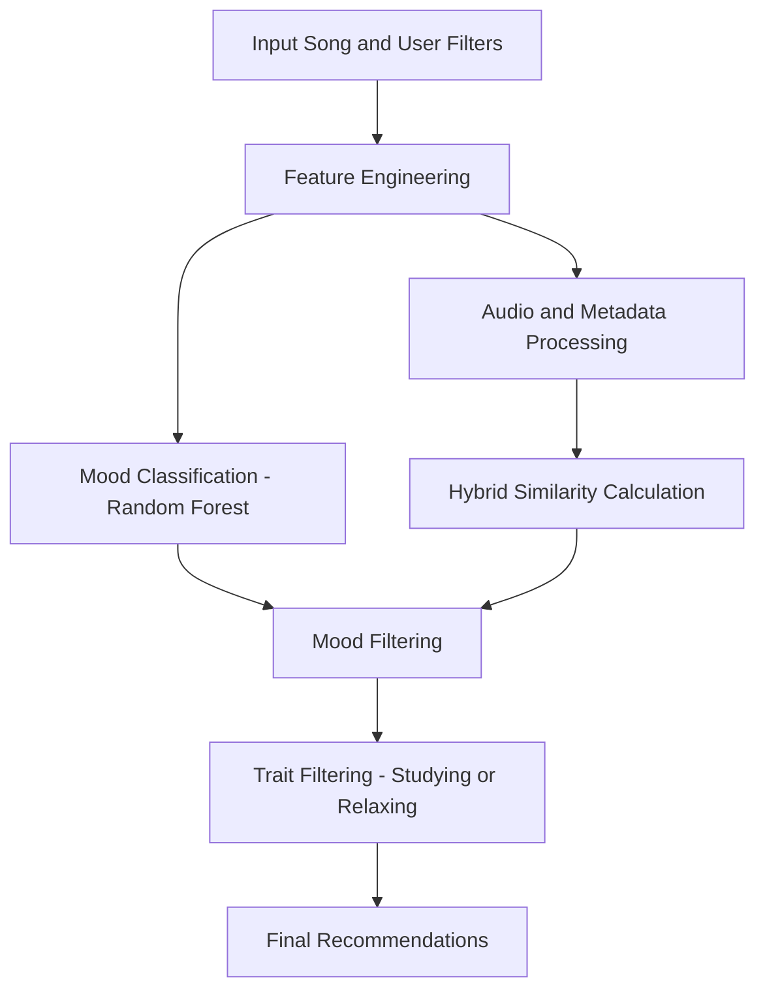

# Vibegator - A Mood-Aware Music Recommender 

  

## 🎬 Introduction
In today’s digital streaming era, music platforms are increasingly focused on delivering hyper-personalized listening experiences. While traditional recommender systems often rely on popularity, collaborative filtering, or genre similarity, they fail to account for the emotional and contextual preferences of users. A person studying may prefer quiet, acoustic tracks, while someone working out seeks energetic, high-tempo songs. Integrating mood and listening intent into music recommendations can significantly enhance user satisfaction and engagement.

**VibeGator** is a mood-aware music recommendation engine that blends audio intelligence with emotional context. It uses a **Random Forest classifier** to predict a song’s **mood** (happy/sad) from audio features, and generates recommendations using a **hybrid similarity model** combining textual metadata and acoustic profile similarity.

🎧 Users can fine-tune suggestions using **listening trait filters** like:
- 🎯 *Studying*
- 🧘 *Relaxing*
- 💃 *Partying*
- 🏋️ *Working Out*

All wrapped inside a responsive, Spotify-inspired web interface built with **Streamlit**.

---

## ❓Problem Definition
🎯 Traditional music recommendation systems: Focus heavily on collaborative filtering. Ignore the user’s **emotional state** and **listening context** and offer generic suggestions that miss the mood/intent behind listening

🚀 **VibeGator solves this by:**
- 🧠 Predicting song mood using audio features (valence, tempo, energy, etc.)
- 🎵 Generating hybrid similarity scores (TF-IDF + acoustic cosine)
- 🧩 Filtering results based on listening traits
- 🌐 Delivering real-time, personalized recommendations through an interactive UI

---

## 🔄 VibeGator Workflow

---

## 🖥️ Application mockup

  

The VibeGator interface allows users to select a song, choose mood preferences, and filter by listening traits — all within an intuitive Streamlit dashboard.

---

## 🌐 Live App

🚀 Try the live demo:  
👉 [**Launch VibeGator on Streamlit Cloud**](https://vibegator-ccagavjaww2b4jw2dzyu5g.streamlit.app/)

> No installation needed — explore song recommendations right in your browser!

---

## 🧪 How to Use the Interface

1. **Select a song** from the dropdown.
2. **Choose a mood preference**:
   - `Auto` will predict the mood of the selected song.
   - Or you can force the system to recommend only `Happy` or `Sad` songs.
3. **Pick a listening trait** *(optional)*:
   - Studying, Relaxing, Party, or Workout.
4. **Select the similarity method**:
   - `Hybrid` (best), `Audio Only`, or `Text Only`.
5. Click **🔍 Get Recommendations** to see your results!

🎯 The model will return a mood-aware, context-driven list of songs that match your selection.

---

✅ *Deployed using [Streamlit Community Cloud](https://streamlit.io/cloud)*  
🔒 All data is processed locally in the session — no user data is stored.

